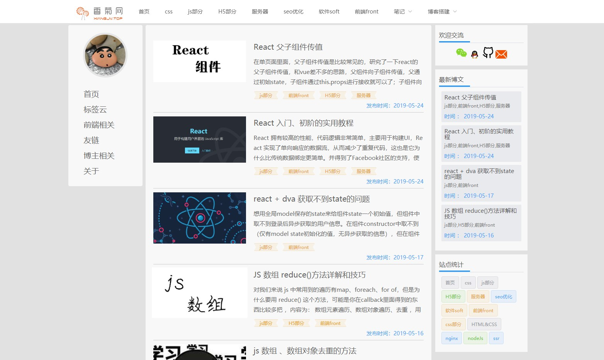

## 技术栈 nuxtJs + element-UI

## 预览地址
(效果预览)[http://www.xiangjv.top/]

## 演示图


## 提示
(nuxt官网)[https://nuxtjs.org/api]


> nkdes bk

## Build Setup

``` bash
# install dependencies
$ yarn install

# serve with hot reload at localhost:3000
$ yarn run dev

# build for production and launch server
$ yarn run build
$ yarn start

# generate static project
$ yarn run generate
```

For detailed explanation on how things work, checkout [Nuxt.js docs](https://nuxtjs.org).

# 上传地址

git@github.com:liuguangqing/bkfront.git